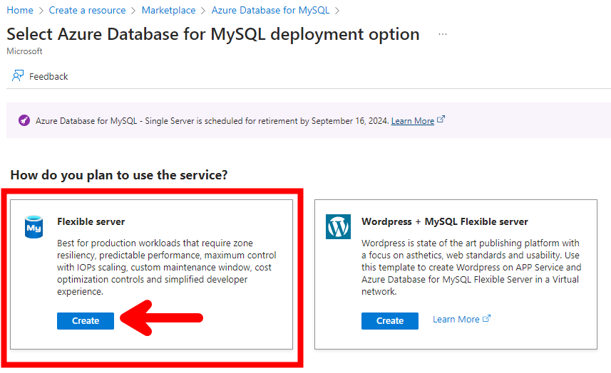
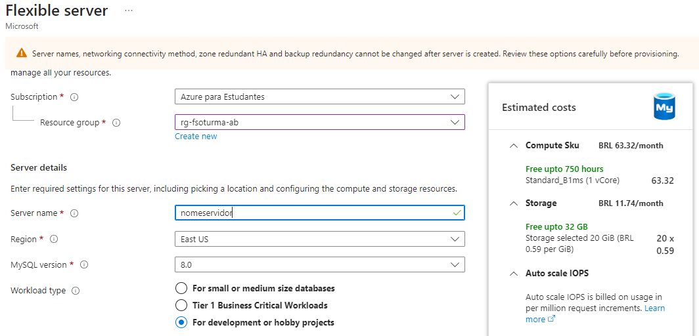
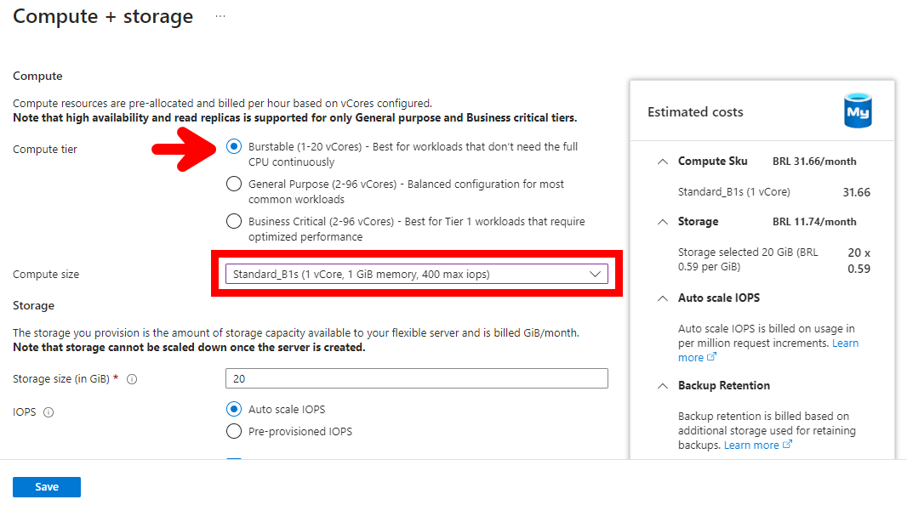
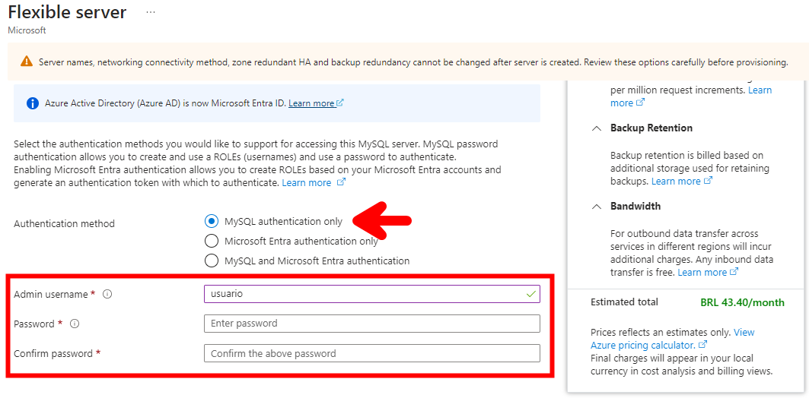
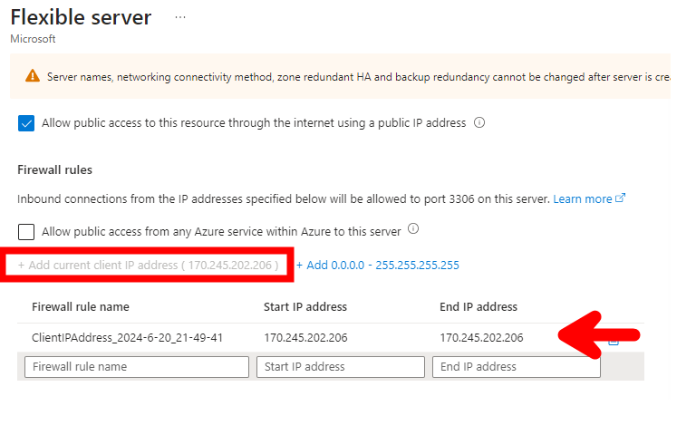
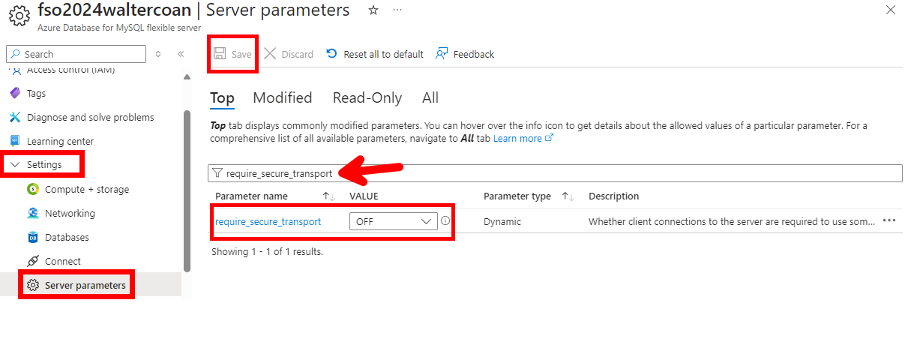
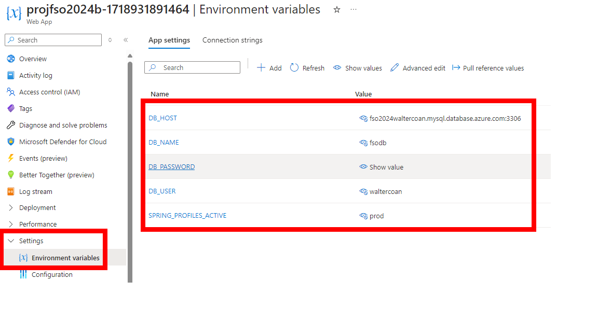

# Projeto Fábrica de Software FSO 2024 Turma B


## Classes de Entidade


# PROJETO projfso2024a
## Validação de campos
- Alterar o arquivo pom.xml para incluir a dependencia
```
    <dependency>
        <groupId>org.springframework.boot</groupId>
        <artifactId>spring-boot-starter-validation</artifactId>
    </dependency>
```

- Na classe de entidade incluir as anotações necessárias para fazer a validação
```
    @NotBlank(message = "Campo nome não pode ser em branco")
    private String nome;
```

## Anotações para mapeamento objeto relacional
O @Column permite configurar o tamanho e a possibilidade de obrigar o usuário a informar o campo
```
@Column(length = 1000, nullable = false)
private String nome;
```
O @Temporal é utilizado para tipar corretamente o campo de data no banco de dados
```
@Temporal(TemporalType.DATE)
private Date dataNascimento;
```

## Classe Startup
- Esta classe foi criada para ser executada na inicialização do software para criar registros padrão no banco de dados
```
@Component
public class Startup {
    @Autowired
    private ClienteService service;

    @EventListener
    public void onApplicationEvent(ContextRefreshedEvent event){
        var cliente1 = new Cliente();
        cliente1.setNome("Zezinho");
        cliente1.setEndereco("Rua lalalalla 100");
        cliente1.setDataNascimento(new Date(2024,04,17));
        service.save(cliente1);
    }
}
```
## Classe Repository
- Gera o código necessário para interação com o banco de dados no formato CRUD
```
@Repository
public interface ClienteRepository 
        extends JpaRepository<Cliente,Long>{
    
}
```
## Classe Service
- Utilizada para implementação da lógica de negócio da aplicação 
```
@Service
public class ClienteServiceImpl 
    implements ClienteService {
    
    @Autowired
    private ClienteRepository repository;
    
    @Override
    public void save(Cliente cliente) {
        repository.save(cliente);
    }

    @Override
    public Cliente getById(long id) {
        return repository.getById(id);
    }

    @Override
    public List<Cliente> getAll() {
        return repository.findAll();
    }
    
}
```


## Conexão MySQL no Azure
- Conectar na rede UNIVILLE-5Ghz
- Alterar o arquivo pom.xml para incluir a dependência so MySQL
```
<dependency>
    <groupId>com.mysql</groupId>
    <artifactId>mysql-connector-j</artifactId>
    <scope>runtime</scope>
</dependency>
```
- Criar o arquivo application-prod.properties conforme exemplo abaixo
```
spring.application.name=projfso2024b
server.port=8080

# Thymeleaf verifique se encontra os templates HTML
spring.thymeleaf.check-template-location=true
# Thymeleaf a pasta dos templates e /templates
spring.thymeleaf.prefix=classpath:/templates/
# Thymeleaf os templates tem extensão .html
spring.thymeleaf.suffix=.html

spring.jpa.database-platform=org.hibernate.dialect.MySQL8Dialect
spring.datasource.driver-class-name=com.mysql.cj.jdbc.Driver
spring.datasource.url=jdbc:mysql://${DB_HOST}/${DB_NAME}?autoReconnect=true&failOverReadOnly=false&maxReconnects=10
spring.datasource.username=${DB_USER}
spring.datasource.password=${DB_PASSWORD}
spring.h2.console.enabled=false
spring.jpa.hibernate.ddl-auto=update
```
- Criar o arquivo .env contendo os valores das variáveis de ambiente para conectar no banco conforme exemplo
```
DB_HOST=
DB_NAME=
DB_USER=
DB_PASSWORD=
```
### Criação do banco de dados no Azure
- Criar uma nova instância de Azure Database for MySQL, selecionar a opção Flexible Server

- Informar o grupo de recurso, nome do servidor, selecionar a região East US e a opção For Development or hobby projects

- Na seleção do tipo de instância, usar o modelo Burstable e escolher o SKU Standard_B1s

- Informar o usuário e senha que deve ser atualizado no arquivo .env

- Na etapa de Networking, incluir o IP publico da UNIVILLE na regra de liberação do firewall do Azure Database for MySQL


### Desabilitar a opção que obriga a conexão por TLS
- Desabilitar o server parameter require_secure_transport para OFF



## Deploy da app no Azure
- Configurar o diretório do Java na variável de ambiente PATH do windows
- Criar a variável de ambiente JAVA_HOME apontando para a pasta principal do java
- Entrar na pasta principal do projeto
```
cd .\projfso2024b\
```
- Realizar login na linha de comando do Azure, caso não tenha faça instalação (https://learn.microsoft.com/en-us/cli/azure/install-azure-cli)
```
az login
``` 
- Instalar o pluggin de deploy da aplicação
```
mvn com.microsoft.azure:azure-webapp-maven-plugin:2.9.0:config
```

```
Create new run configuration (Y/N) [Y]: Y
Define value for OS [Linux]:
  1: Windows
* 2: Linux
  3: Docker
Enter your choice: 2
Define value for javaVersion [Java 17]:
  1: Java 8
  2: Java 11
* 3: Java 17
Enter your choice: 3
Define value for pricingTier [P1v2]:
   1: B1
   2: B2
   3: B3
   4: D1
   5: EP1
   6: EP2
   7: EP3
   8: F1
*  9: P1v2
  10: P1v3
  11: P2v2
  12: P2v3
  13: P3v2
  14: P3v3
  15: S1
  16: S2
  17: S3
  18: Y1
Enter your choice: 8
Please confirm webapp properties
AppName : projfso2024b-1718931891464
ResourceGroup : projfso2024b-1718931891464-rg
Region : centralus
PricingTier : F1
OS : Linux
Java Version: Java 17
Web server stack: Java SE
Deploy to slot : false
Confirm (Y/N) [Y]: Y
```

- Faça o deploy da aplicação
```
mvn package azure-webapp:deploy -DskipTests
```
- Configurar as seguintes variáveis de ambiente no Web App



## Implementação do JWT no projeto API
1) alterar o arquivo pom.xml para inclur a dependência do Spring Security
```
<dependency>
    <groupId>org.springframework.boot</groupId>
    <artifactId>spring-boot-starter-security</artifactId>
</dependency>
<dependency>
    <groupId>io.jsonwebtoken</groupId>
    <artifactId>jjwt-api</artifactId>
    <version>0.11.5</version>
</dependency>
<dependency>
    <groupId>io.jsonwebtoken</groupId>
    <artifactId>jjwt-impl</artifactId>
    <version>0.11.5</version>
</dependency>
<dependency>
    <groupId>io.jsonwebtoken</groupId>
    <artifactId>jjwt-jackson</artifactId>
    <version>0.11.5</version>
</dependency>
```
2) Criar a entidade Usuário
```
package br.univille.projapifso2024a.entity;

import jakarta.persistence.Entity;
import jakarta.persistence.GeneratedValue;
import jakarta.persistence.GenerationType;
import jakarta.persistence.Id;


@Entity
public class Usuario {
    @Id
    @GeneratedValue(strategy = GenerationType.IDENTITY)
    private long id;
    private String usuario;
    private String senha;

    public long getId() {
        return id;
    }
    public void setId(long id) {
        this.id = id;
    }
    public String getUsuario() {
        return usuario;
    }
    public void setUsuario(String usuario) {
        this.usuario = usuario;
    }
    public String getSenha() {
        return senha;
    }
    public void setSenha(String senha) {
        this.senha = senha;
    }
}
```
3) Criar o repositório do Usuário
```
import java.util.Optional;
import org.springframework.data.jpa.repository.JpaRepository;
import org.springframework.stereotype.Repository;
import br.univille.projapifso2024a.entity.Usuario;

@Repository
public interface UsuarioRepository 
    extends JpaRepository<Usuario,Long>{
        /*select * from usuario wher usuario.usuario = 'zezinho' */
        Optional<Usuario> findByUsuario(String usuario);
    
}
```
4) Criar o serviço do usuário
```
package br.univille.projapifso2024a.service;

import java.util.Optional;
import br.univille.projapifso2024a.entity.Usuario;

public interface UsuarioService {
    void save(Usuario usuario);
    Optional<Usuario> findByUsuario(String usuario);
}
```
```
package br.univille.projapifso2024a.service.impl;

import java.util.ArrayList;
import java.util.Optional;

import org.springframework.beans.factory.annotation.Autowired;
import org.springframework.security.core.userdetails.UserDetails;
import org.springframework.security.core.userdetails.UserDetailsService;
import org.springframework.security.core.userdetails.UsernameNotFoundException;
import org.springframework.stereotype.Service;

import br.univille.projapifso2024a.entity.Usuario;
import br.univille.projapifso2024a.repository.UsuarioRepository;
import br.univille.projapifso2024a.service.UsuarioService;
import org.springframework.security.core.userdetails.User;

@Service
public class UsuarioServiceImpl implements UserDetailsService,UsuarioService{

    @Autowired
    private UsuarioRepository repository;

    @Override
    public void save(Usuario usuario) {
        repository.save(usuario);
    }

    @Override
    public Optional<Usuario> findByUsuario(String usuario) {
        return repository.findByUsuario(usuario);
    }

    @Override
    public UserDetails loadUserByUsername(String username) throws UsernameNotFoundException {
        var usuario = repository.findByUsuario(username);
        if(usuario.isPresent()){
            var usuarioEncontrado = usuario.get();
            return new User(usuarioEncontrado.getUsuario(),
                            usuarioEncontrado.getSenha(),
                            new ArrayList<>());
        }
        return null;
    }
    
}

```
5) Alterar a classe startup para cadastrar um novo usuario padrão
```
@Component
public class Startup {
    @Autowired
    private ClienteService service;

    @Autowired
    private UsuarioService serviceUsuario;

    @EventListener
    public void onApplicationEvent(ContextRefreshedEvent event){
        var cliente1 = new Cliente();
        cliente1.setNome("Zezinho");
        cliente1.setEndereco("Rua lalalalla 100");
        cliente1.setDataNascimento(new Date(2024,04,17));
        service.save(cliente1);

        var usuario = new Usuario();
        usuario.setUsuario("admin");
        usuario.setSenha("admin");
        serviceUsuario.save(usuario);
    }
}
```
6) Implementar a classe de geração e validação dos tokens JWT JWTUtil
```
package br.univille.projapifso2024a.security;

import java.util.Date;
import java.util.HashMap;
import java.util.Map;
import java.util.function.Function;

import org.springframework.beans.factory.annotation.Value;
import org.springframework.security.core.userdetails.UserDetails;
import org.springframework.stereotype.Component;


import io.jsonwebtoken.Claims;
import io.jsonwebtoken.Jwts;
import io.jsonwebtoken.SignatureAlgorithm;

@Component
public class JWTUtil {
    @Value("${fsoapi2024.secretkey}")
    private String SECRET_KEY;
    public String extractUserName(String token){
        return extractClaim(token, Claims::getSubject);
    }

    private <T> T extractClaim(String token, Function<Claims, T> claimsResolver) {
        final Claims claims = extractAllClaims(token);
        return claimsResolver.apply(claims);
    }

    private Claims extractAllClaims(String token) {
        return Jwts.parser().setSigningKey(SECRET_KEY).parseClaimsJws(token).getBody();
    }
    private Boolean isTokenExpired(String token){
        return extractExpiration(token).before(new Date());
    }

    private Date extractExpiration(String token) {
        return extractClaim(token, Claims::getExpiration);
    }

    public String generateToken(UserDetails userDetails){
        Map<String,Object> claims = new HashMap<>();
        return createToken(claims, userDetails.getUsername());
    }

    private String createToken(Map<String, Object> claims, String subject) {
        return Jwts
            .builder()
            .setClaims(claims)
            .setSubject(subject)
            .setIssuedAt(new Date(System.currentTimeMillis()))
            .setExpiration(new Date(System.currentTimeMillis() + 1000 * 60 * 60 * 10))
            .signWith(SignatureAlgorithm.HS256, SECRET_KEY).compact();
    }

    public Boolean validateToken (String token, UserDetails userDetails){
        final String userName = extractUserName(token);
        return (userName.equals(userDetails.getUsername()) && !isTokenExpired(token));
    }
}

```
7) Alterar o arquivo application.properties para incluir a chave secreta de geração dos JWTs
```
spring.application.name=projapifso2024a
server.port=8081

spring.jpa.database-platform=org.hibernate.dialect.H2Dialect
spring.h2.console.enabled=true
spring.h2.console.path=/bancodedados
spring.datasource.driver-class-name=org.h2.Driver
spring.datasource.url=jdbc:h2:file:~/dbapi;DB_CLOSE_DELAY=-1;MODE=MYSQL
spring.datasource.username=sa
spring.datasource.password=
spring.jpa.hibernate.ddl-auto=create-drop


fsoapi2024.secretkey=j325895j4985j234095jj234095j23495395j4985j234095j
```
8) Implementar a classe JWTRequestFilter para incluir o filtro das requisições que obriga ao cliente passar o JWT
```
package br.univille.projapifso2024a.security;

import java.io.IOException;

import org.springframework.beans.factory.annotation.Autowired;
import org.springframework.security.authentication.UsernamePasswordAuthenticationToken;
import org.springframework.security.core.context.SecurityContextHolder;
import org.springframework.security.core.userdetails.UserDetailsService;
import org.springframework.security.web.authentication.WebAuthenticationDetailsSource;
import org.springframework.stereotype.Component;
import org.springframework.web.filter.OncePerRequestFilter;

import jakarta.servlet.FilterChain;
import jakarta.servlet.ServletException;
import jakarta.servlet.http.HttpServletRequest;
import jakarta.servlet.http.HttpServletResponse;

@Component
public class JWTRequestFilter extends OncePerRequestFilter{
    @Autowired
    private JWTUtil serviceJWT;
    @Autowired
    private UserDetailsService serviceUser;

    
    @Override
    protected void doFilterInternal(HttpServletRequest request, 
                                    HttpServletResponse response, 
                                    FilterChain filterChain)
            throws ServletException, IOException {
        
        var authHeader = request.getHeader("Authorization");
        String username = null;
        String token = null;

        if(authHeader != null &&
            authHeader.startsWith("Bearer ")){
            token = authHeader.substring(7);
            username = serviceJWT.extractUserName(token);
        }

        if(username != null &&
            SecurityContextHolder.getContext().getAuthentication() == null){
            var userDetail = serviceUser.loadUserByUsername(username);
            if(serviceJWT.validateToken(token, userDetail)){
                UsernamePasswordAuthenticationToken ut = 
                    new UsernamePasswordAuthenticationToken(username, null, userDetail.getAuthorities());
                
                ut.setDetails(new WebAuthenticationDetailsSource().buildDetails(request));
                SecurityContextHolder.getContext().setAuthentication(ut);
            }
        }
        
        filterChain.doFilter(request, response);
    }
}
```

8) Implementar a classe SecurityConfigurer para aplicar o filtro de requests
```
package br.univille.projapifso2024a.security;

import org.springframework.beans.factory.annotation.Autowired;
import org.springframework.context.annotation.Bean;
import org.springframework.context.annotation.Configuration;
import org.springframework.security.config.annotation.web.builders.HttpSecurity;
import org.springframework.security.config.annotation.web.configuration.EnableWebSecurity;
import org.springframework.security.config.http.SessionCreationPolicy;
import org.springframework.security.web.SecurityFilterChain;
import org.springframework.security.web.authentication.UsernamePasswordAuthenticationFilter;

import jakarta.servlet.DispatcherType;

@Configuration
@EnableWebSecurity(debug = true)
public class SecurityConfigurer {

    @Autowired
    private JWTRequestFilter jwtAuthFilter;
    
    @Bean
    public SecurityFilterChain securityFilterChain(HttpSecurity http) throws Exception {
        http
                .csrf(csrf -> csrf.disable())
                .cors(cors  -> cors.disable())
                .httpBasic(basic -> basic.disable())
                .formLogin(form -> form.disable())
                .authorizeHttpRequests(auth -> {
                        auth
                        .dispatcherTypeMatchers(DispatcherType.FORWARD, DispatcherType.ERROR).permitAll()
                        .requestMatchers("/api/v1/auth/signin").permitAll()
                        .anyRequest().authenticated().and()
                        .addFilterBefore(jwtAuthFilter, UsernamePasswordAuthenticationFilter.class);
                })
                
                                
                .sessionManagement(sess -> sess.sessionCreationPolicy(SessionCreationPolicy.STATELESS));
        
        return http.build();
    }

}
```

9) Criar o controlador com o método de autenticação
```
package br.univille.projapifso2024a.controller;

import org.springframework.beans.factory.annotation.Autowired;
import org.springframework.http.HttpStatus;
import org.springframework.http.ResponseEntity;
import org.springframework.security.core.userdetails.UserDetailsService;
import org.springframework.web.bind.annotation.PostMapping;
import org.springframework.web.bind.annotation.RequestBody;
import org.springframework.web.bind.annotation.RequestMapping;
import org.springframework.web.bind.annotation.RestController;

import br.univille.projapifso2024a.entity.Usuario;
import br.univille.projapifso2024a.security.JWTUtil;

@RestController
@RequestMapping("/api/v1/auth")
public class AuthenticationControllerAPI {
    @Autowired
    private UserDetailsService service;
    @Autowired
    private JWTUtil serviceJWT;

    @PostMapping("/signin")
    public ResponseEntity signin(@RequestBody Usuario usuario){
        var userDetail = service.loadUserByUsername(usuario.getUsuario());
        if(userDetail.getPassword().equals(usuario.getSenha())){
            var token = serviceJWT.generateToken(userDetail);
            return ResponseEntity.ok(token);
        }
        return ResponseEntity.status(HttpStatus.FORBIDDEN).build();

    }
    
}
```

10) Chamada do método de autenticação no testeapi.rest
```
# @name signin
POST http://localhost:8081/api/v1/auth/signin
Content-Type: application/json

{
    "usuario": "admin",
    "senha": "admin"
}

###
@token = {{signin.response.body.*}}
```

11) Alterar os métodos passando o token em cada requisição
```
### POST /api/v1/cidade
POST http://localhost:8081/api/v1/cidades
Content-Type: application/json
Authorization: Bearer {{token}}

{
    "nome": "Joinville",
    "estado": "Santa Catarina"
}

```