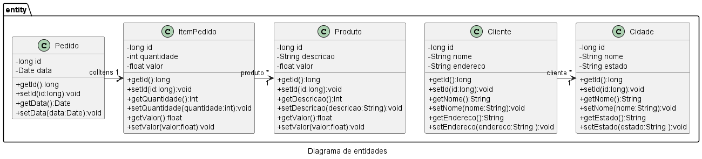

# Projeto Fábrica de Software FSO 2024 Turma B


## Classes de Entidade


# PROJETO projfso2024a
## Validação de campos
- Alterar o arquivo pom.xml para incluir a dependencia
```
    <dependency>
        <groupId>org.springframework.boot</groupId>
        <artifactId>spring-boot-starter-validation</artifactId>
    </dependency>
```

- Na classe de entidade incluir as anotações necessárias para fazer a validação
```
    @NotBlank(message = "Campo nome não pode ser em branco")
    private String nome;
```

## Anotações para mapeamento objeto relacional
O @Column permite configurar o tamanho e a possibilidade de obrigar o usuário a informar o campo
```
@Column(length = 1000, nullable = false)
private String nome;
```
O @Temporal é utilizado para tipar corretamente o campo de data no banco de dados
```
@Temporal(TemporalType.DATE)
private Date dataNascimento;
```

## Classe Startup
- Esta classe foi criada para ser executada na inicialização do software para criar registros padrão no banco de dados
```
@Component
public class Startup {
    @Autowired
    private ClienteService service;

    @EventListener
    public void onApplicationEvent(ContextRefreshedEvent event){
        var cliente1 = new Cliente();
        cliente1.setNome("Zezinho");
        cliente1.setEndereco("Rua lalalalla 100");
        cliente1.setDataNascimento(new Date(2024,04,17));
        service.save(cliente1);
    }
}
```
## Classe Repository
- Gera o código necessário para interação com o banco de dados no formato CRUD
```
@Repository
public interface ClienteRepository 
        extends JpaRepository<Cliente,Long>{
    
}
```
## Classe Service
- Utilizada para implementação da lógica de negócio da aplicação 
```
@Service
public class ClienteServiceImpl 
    implements ClienteService {
    
    @Autowired
    private ClienteRepository repository;
    
    @Override
    public void save(Cliente cliente) {
        repository.save(cliente);
    }

    @Override
    public Cliente getById(long id) {
        return repository.getById(id);
    }

    @Override
    public List<Cliente> getAll() {
        return repository.findAll();
    }
    
}
```


## Conexão MySQL no Azure
- Conectar na rede UNIVILLE-5Ghz
- Alterar o arquivo pom.xml para incluir a dependência so MySQL
```
<dependency>
    <groupId>com.mysql</groupId>
    <artifactId>mysql-connector-j</artifactId>
    <scope>runtime</scope>
</dependency>
```
- Criar o arquivo application-prod.properties conforme exemplo abaixo
```
spring.application.name=projfso2024b
server.port=8080

# Thymeleaf verifique se encontra os templates HTML
spring.thymeleaf.check-template-location=true
# Thymeleaf a pasta dos templates e /templates
spring.thymeleaf.prefix=classpath:/templates/
# Thymeleaf os templates tem extensão .html
spring.thymeleaf.suffix=.html

spring.jpa.database-platform=org.hibernate.dialect.MySQL8Dialect
spring.datasource.driver-class-name=com.mysql.cj.jdbc.Driver
spring.datasource.url=jdbc:mysql://${DB_HOST}/${DB_NAME}?autoReconnect=true&failOverReadOnly=false&maxReconnects=10
spring.datasource.username=${DB_USER}
spring.datasource.password=${DB_PASSWORD}
spring.h2.console.enabled=false
spring.jpa.hibernate.ddl-auto=update
```
- Criar o arquivo .env contendo os valores das variáveis de ambiente para conectar no banco conforme exemplo
```
DB_HOST=
DB_NAME=
DB_USER=
DB_PASSWORD=
```
### Criação do banco de dados no Azure
- Criar uma nova instância de Azure Database for MySQL, selecionar a opção Flexible Server

- Informar o grupo de recurso, nome do servidor, selecionar a região East US e a opção For Development or hobby projects

- Na seleção do tipo de instância, usar o modelo Burstable e escolher o SKU Standard_B1s

- Informar o usuário e senha que deve ser atualizado no arquivo .env

- Na etapa de Networking, incluir o IP publico da UNIVILLE na regra de liberação do firewall do Azure Database for MySQL


### Desabilitar a opção que obriga a conexão por TLS
- Desabilitar o server parameter require_secure_transport para OFF


## Deploy da app no Azure
- Configurar o diretório do Java na variável de ambiente PATH do windows
- Criar a variável de ambiente JAVA_HOME apontando para a pasta principal do java
- Entrar na pasta principal do projeto
```
cd .\projfso2024b\
```
- Realizar login na linha de comando do Azure, caso não tenha faça instalação (https://learn.microsoft.com/en-us/cli/azure/install-azure-cli)
```
az login
``` 
- Instalar o pluggin de deploy da aplicação
```
mvn com.microsoft.azure:azure-webapp-maven-plugin:2.9.0:config
```

```
Create new run configuration (Y/N) [Y]: Y
Define value for OS [Linux]:
  1: Windows
* 2: Linux
  3: Docker
Enter your choice: 2
Define value for javaVersion [Java 17]:
  1: Java 8
  2: Java 11
* 3: Java 17
Enter your choice: 3
Define value for pricingTier [P1v2]:
   1: B1
   2: B2
   3: B3
   4: D1
   5: EP1
   6: EP2
   7: EP3
   8: F1
*  9: P1v2
  10: P1v3
  11: P2v2
  12: P2v3
  13: P3v2
  14: P3v3
  15: S1
  16: S2
  17: S3
  18: Y1
Enter your choice: 8
Please confirm webapp properties
AppName : projfso2024b-1718931891464
ResourceGroup : projfso2024b-1718931891464-rg
Region : centralus
PricingTier : F1
OS : Linux
Java Version: Java 17
Web server stack: Java SE
Deploy to slot : false
Confirm (Y/N) [Y]: Y
```

- Faça o deploy da aplicação
```
mvn package azure-webapp:deploy -DskipTests
```
- Configurar as seguintes variáveis de ambiente no Web App
